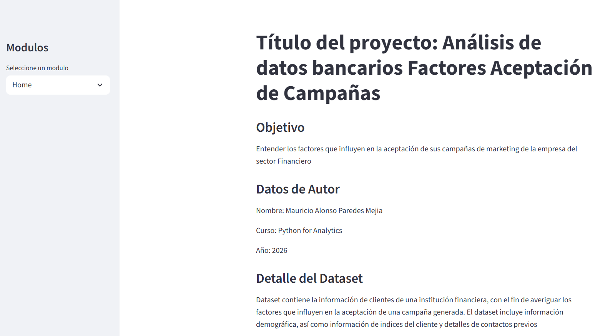
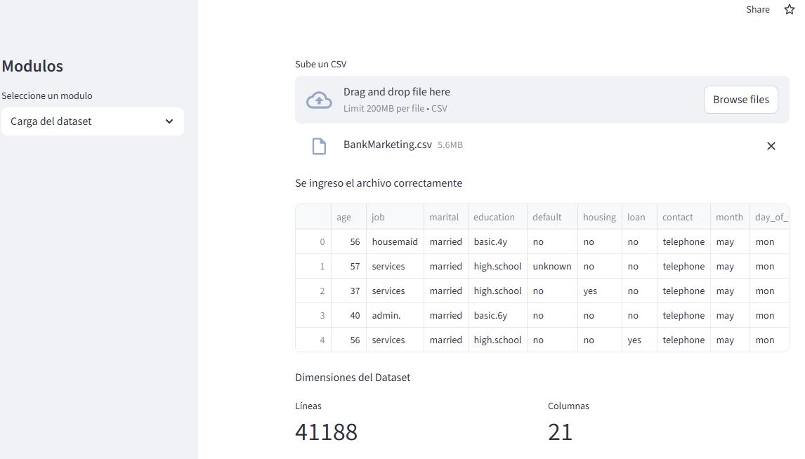

<h1>ANALISIS-BANCARIO-DMC</h1>

<em>Facilitando decisiones bancarias más inteligentes sin complicaciones</em>

<em>Construido con las herramientas y tecnologías:</em>

 

<h2>Descripción</h2>

analisis-bancario-DMC Es una herramienta integral para desarrolladores diseñada para facilitar el análisis de datos bancarios y la toma de decisiones a través de un panel interactivo basado en la web. Creada con Streamlit, pandas, seaborn y openpyxl, ofrece una experiencia fluida para explorar la aceptación de las campañas de marketing por parte de los clientes dentro del sector financiero.

<strong>¿Por qué analisis-bancario-DMC?</strong>

Este proyecto tiene como objetivo optimizar los flujos de trabajo de análisis bancario, respaldar las decisiones basadas en datos y garantizar la coherencia de los datos en todas las operaciones financieras. Las características principales incluyen:

<ul class="list-disc pl-4 my-0">
<li class="my-0">🧩 <strong>🎯 Dashboard Interactivo:</strong> Proporciona una interfaz intuitiva para explorar conjuntos de datos y módulos de análisis.</li>
<li class="my-0">🛠️ <strong>Data Processing &amp; Visualization:</strong> Aprovecha pandas y seaborn para una manipulación de datos robusta y visualizaciones reveladoras..</li>
<li class="my-0">📊 <strong>Inttegraciión a Excel:</strong> Admite el manejo de archivos Excel con openpyxl para una gestión flexible de los datos.</li>
<li class="my-0">🚀 <strong>Arquitectura Modular:</strong> El script central coordina el análisis, lo que permite una fácil personalización y ampliación.</li>
<li class="my-0">🔗 <strong> Integración intuitiva:</strong> Diseñado para integrarse fácilmente en los flujos de trabajo de datos financieros existentes para una gestión eficiente.</li>
</ul>

<h2>Capturas de la app</h2>
<h3>View Home</h3>

<h3>Carga dataset</h3>

<h3>Análisis de datos exploratorio item 1 & 2</h3>

<h3>Análisis de datos exploratorio item 3 & 4</h3>

<h3>Análisis de datos exploratorio item 5 & 6</h3>

<h3>Análisis de datos exploratorio item 7 & 8</h3>

<h3>Análisis de datos exploratorio item 9 & 10</h3>

<h2>Instrucciones de ejecución</h2>
<h3>Prerequisitos</h3>

Este proyecto requiere las siguientes dependencias:

<ul class="list-disc pl-4 my-0">
<li class="my-0"><strong>Programming Language:</strong> Python</li>
<li class="my-0"><strong>Package Manager:</strong> Pip</li>
</ul>
<h3>Instalación</h3>

Construye analisis-bancario-DMC desde la fuente e instale las dependencias:

<ol>
<li class="my-0">

<strong>Clona el repositorio:</strong>

<pre><code class="language-sh">❯ git clone https://github.com/Destreyer9/analisis-bancario-DMC
</code></pre>
</li>
<li class="my-0">

<strong>Navega el directorio del proyecto:</strong>

<pre><code class="language-sh">❯ cd analisis-bancario-DMC
</code></pre>
</li>
<li class="my-0">

<strong>Instala las dependencias:</strong>

</li>
</ol>

<strong>Usando <a href="https://pypi.org/project/pip/">pip</a>:</strong>

<pre><code class="language-sh">❯ pip install -r requirements.txt
</code></pre>
<h3>Usage</h3>

Corre el proyecto con:

<strong>Usando <a href="https://pypi.org/project/pip/">pip</a>:</strong>

<pre><code class="language-sh">python {entrypoint}
</code></pre>

<h2>Links relevantes</h2>

<strong><a href="https://x8arvnju357buvztbpkn2a.streamlit.app/">website</a></strong>

<a href="#top">⬆ Return</a>

